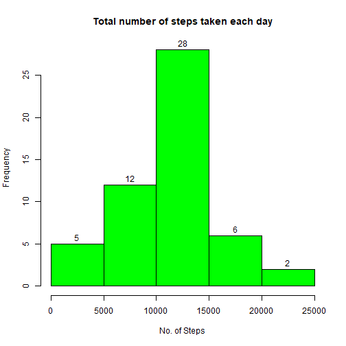
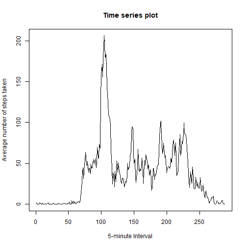
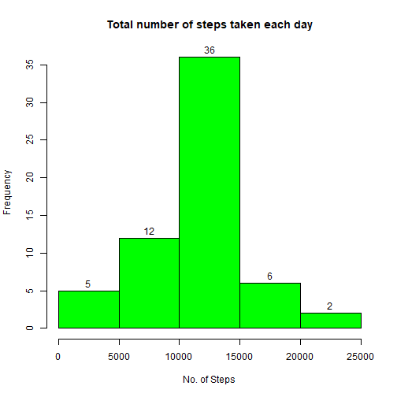
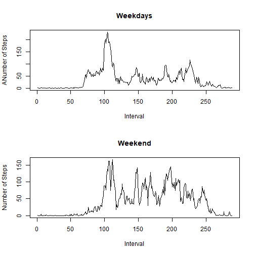

## Loading and preprocessing the data


```r
activity <- read.csv("activity.csv", header = TRUE)

head(activity)
```

```
##   steps       date interval
## 1    NA 2012-10-01        0
## 2    NA 2012-10-01        5
## 3    NA 2012-10-01       10
## 4    NA 2012-10-01       15
## 5    NA 2012-10-01       20
## 6    NA 2012-10-01       25
```

```r
sapply(activity, function (x) sum(is.na(x)))
```

```
##    steps     date interval 
##     2304        0        0
```

## What is mean total number of steps taken per day?


```r
step_each_day <- tapply(activity$steps, activity$date, sum)

head(step_each_day)
```

```
## 2012-10-01 2012-10-02 2012-10-03 2012-10-04 2012-10-05 2012-10-06 
##         NA        126      11352      12116      13294      15420
```

```r
hist(step_each_day, xlab = "No. of Steps", main = "Total number of steps taken each day", col = "green", labels = TRUE)
```



```r
mean_steps <- floor(mean(step_each_day, na.rm = TRUE))
mean_steps
```

```
## [1] 10766
```

```r
median_steps <- median(step_each_day, na.rm = TRUE)
median_steps
```

```
## [1] 10765
```


## What is the average daily activity pattern?


```r
average_steps <- tapply(activity$steps, activity$interval, mean, na.rm = TRUE)

plot(average_steps,type = "l", xlab = "5-minute Interval", ylab = "Average number of steps taken", main = "Time series plot" )
```



```r
which.max(average_steps)
```

```
## 835 
## 104
```

## Imputing missing values


```r
Missing_rows <- sapply(activity, function (x) sum(is.na(x)))

No_of_missing_rows <- sum(Missing_rows)

activity_imp <- activity

library(plyr)

activity_imp <- ddply(activity_imp, "interval", mutate, steps = impute(steps,mean))

step_each_day_imp <- tapply(activity_imp$steps, activity_imp$date, sum)
head(step_each_day_imp)
```

```
## 2012-10-01 2012-10-02 2012-10-03 2012-10-04 2012-10-05 2012-10-06 
##   10766.19     126.00   11352.00   12116.00   13294.00   15420.00
```

```r
mean(step_each_day_imp)
```

```
## [1] 10766.19
```

```r
median(step_each_day_imp)
```

```
## [1] 10766.19
```

```r
hist(step_each_day_imp, xlab = "No. of Steps", main = "Total number of steps taken each day", col = "green", labels = TRUE)
```



## Are there differences in activity patterns between weekdays and weekends?


```r
activity_imp$wday <- wday(activity_imp$date, label = TRUE)  

Weekday <- activity_imp %>%
           select(steps, date, interval, wday) %>%
           filter(wday %in% c("Mon", "Tue", "Wed", "Thu", "Fri"))

Weekend <- activity_imp %>%
           select(steps, date, interval, wday) %>%
           filter(wday %in% c("Sat", "Sun"))

steps_Weekday <- tapply(Weekday$steps, Weekday$interval, mean)

steps_Weekend <- tapply(Weekend$steps, Weekend$interval, mean)

par(mfrow = c(2,1))

plot(steps_Weekday, type = "l", main = "Weekdays",
     xlab = "Interval",
     ylab = "ANumber of Steps")

plot(steps_Weekend, type = "l", main = "Weekend",
     xlab = "Interval",
     ylab = "Number of Steps")
```


